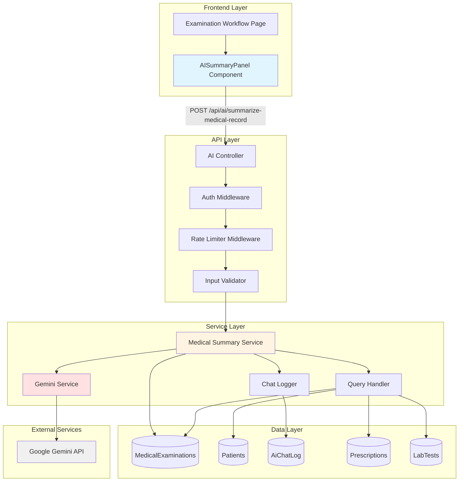
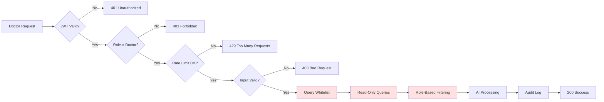
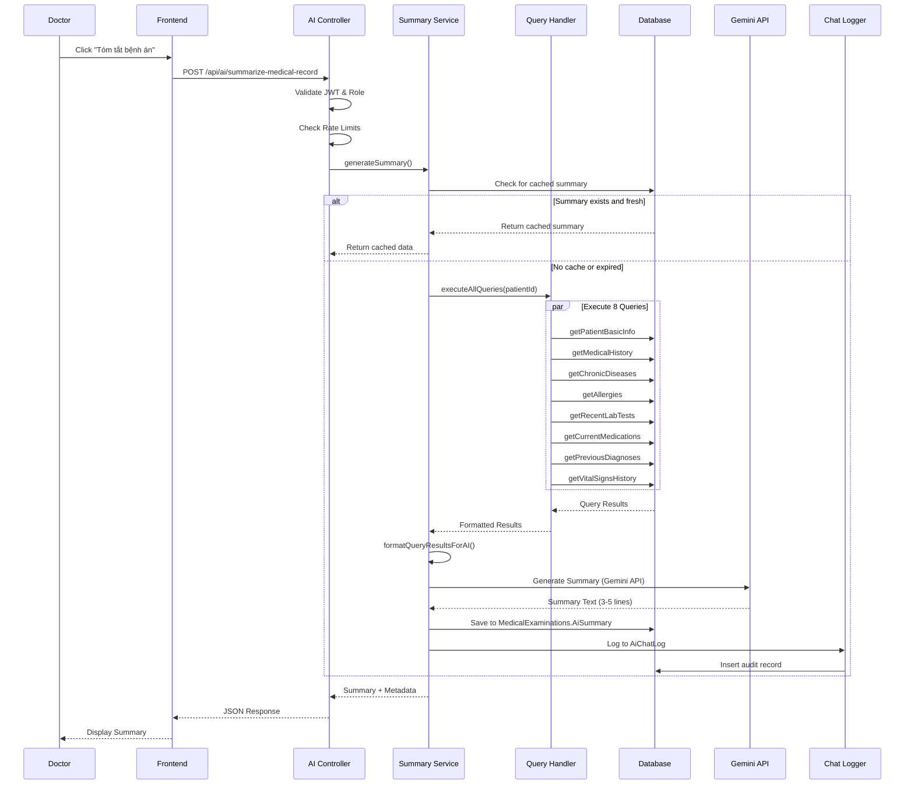

# Design Document: AI Medical Record Summary

## Overview

The AI Medical Record Summary feature provides automated, concise 3-5 line summaries of patient medical histories to assist doctors before examinations. This feature extends the existing AI chatbot infrastructure with specialized functionality for medical record summarization, implementing a secure, read-only architecture that uses pre-defined queries and Google Gemini AI.

### Key Design Principles

1. **Security First**: Read-only access through whitelisted pre-defined queries only
2. **Doctor-Only Access**: Strict role-based authorization (role = 2)
3. **Non-Blocking**: Failures do not disrupt examination workflow
4. **Performance**: 95% of requests complete within 5 seconds
5. **Audit Trail**: Complete logging of all summary requests for compliance

### Integration Points

- **Existing Infrastructure**: Leverages geminiService, queryHandler, and conversationManager
- **Database**: Extends MedicalExaminations table with summary storage fields
- **Frontend**: Integrates into examination workflow with React component
- **API**: New endpoint `/api/ai/summarize-medical-record` under existing `/api/ai` routes

## Architecture

### High-Level Architecture



### Request Flow

1. **User Action**: Doctor clicks "Tóm tắt bệnh án bằng AI" button or examination starts (if auto-trigger enabled)
2. **Authentication**: JWT token validated, role verified (must be doctor, role = 2)
3. **Rate Limiting**: Check per-patient (10/hour) and global (30/minute) limits
4. **Input Validation**: Validate medicalRecordId and patientId
5. **Data Retrieval**: Execute 8 pre-defined queries to gather patient data
6. **AI Processing**: Gemini generates 3-5 line summary in Vietnamese
7. **Persistence**: Save summary to MedicalExaminations.AiSummary field
8. **Audit Logging**: Log interaction to AiChatLog table
9. **Response**: Return summary with metadata to frontend

### Security Architecture



**Security Layers:**

1. **Authentication Layer**: JWT validation, role verification
2. **Rate Limiting Layer**: Per-patient and global limits
3. **Query Whitelist Layer**: Only 8 pre-defined queries allowed
4. **Read-Only Layer**: Database connections with SELECT-only permissions
5. **Role-Based Filtering**: Doctors only see their assigned patients
6. **Audit Layer**: Complete logging of all requests

## Components and Interfaces

### Backend Components

#### 1. Medical Summary Service (`src/services/medicalSummary.service.js`)

**Purpose**: Orchestrates the medical record summarization process

**Key Methods**:

```javascript
/**
 * Generate AI summary for a medical record
 * @param {number} medicalRecordId - Medical examination ID
 * @param {number} patientId - Patient ID
 * @param {number} userId - Doctor's user ID
 * @param {number} userRole - Doctor's role (must be 2)
 * @returns {Promise<Object>} Summary data with metadata
 */
async generateSummary(medicalRecordId, patientId, userId, userRole)

/**
 * Get cached summary if exists and not expired
 * @param {number} medicalRecordId - Medical examination ID
 * @returns {Promise<Object|null>} Cached summary or null
 */
async getCachedSummary(medicalRecordId)

/**
 * Execute all pre-defined queries for medical summary
 * @param {number} patientId - Patient ID
 * @param {number} userId - Doctor's user ID
 * @param {number} userRole - Doctor's role
 * @returns {Promise<Array>} Array of query results
 */
async executeAllQueries(patientId, userId, userRole)

/**
 * Format query results for AI consumption
 * @param {Array} queryResults - Raw query results
 * @returns {string} Formatted text for Gemini
 */
formatQueryResultsForAI(queryResults)
```

**Dependencies**:
- `geminiService`: AI text generation
- `queryHandler`: Execute pre-defined queries
- `MedicalExamination` model: Save/retrieve summaries
- `chatLogger`: Audit logging

#### 2. AI Controller Extension (`src/controllers/ai.controller.js`)

**New Endpoint Handler**:

```javascript
/**
 * POST /api/ai/summarize-medical-record
 * Generate AI summary for a medical record
 * 
 * @param {Object} req.body - { medicalRecordId, patientId }
 * @param {Object} req.user - Authenticated user (must be doctor)
 * @returns {Object} { success, data: { summary, queryIds, generatedAt, remainingRequests } }
 */
export const summarizeMedicalRecord = async (req, res, next)
```

**Request Validation**:
- `medicalRecordId`: Required, integer, 1 to 9223372036854775807
- `patientId`: Required, integer, 1 to 9223372036854775807
- Content-Type: Must be `application/json`

**Response Format**:

```json
{
  "success": true,
  "data": {
    "summary": "Tiền sử: Bệnh nhân có tiền sử tăng huyết áp...",
    "queryIds": ["getPatientBasicInfo", "getMedicalHistory", ...],
    "generatedAt": "2024-01-15T10:30:00+07:00",
    "remainingRequests": 8
  }
}
```

#### 3. Rate Limiter Middleware (`src/middleware/aiSummaryRateLimiter.js`)

**Purpose**: Enforce rate limits for summary requests

**Configuration**:
- Per-patient limit: 10 requests per hour per doctor per patient
- Global limit: 30 requests per minute per doctor
- Storage: In-memory Map with automatic cleanup

**Implementation**:

```javascript
/**
 * Rate limiter for AI summary requests
 * Tracks both per-patient and global limits
 */
export const aiSummaryRateLimiter = (req, res, next) => {
  const userId = req.user.id;
  const patientId = req.body.patientId;
  
  // Check per-patient limit (10/hour)
  const perPatientKey = `${userId}:${patientId}`;
  const perPatientLimit = checkLimit(perPatientKey, 10, 3600000);
  
  if (!perPatientLimit.allowed) {
    return res.status(429).json({
      success: false,
      error: {
        code: 'RATE_LIMIT_EXCEEDED_PER_PATIENT',
        message: 'Đã vượt quá giới hạn tóm tắt cho bệnh nhân này',
        statusCode: 429,
        resetTime: perPatientLimit.resetTime
      }
    });
  }
  
  // Check global limit (30/minute)
  const globalKey = `global:${userId}`;
  const globalLimit = checkLimit(globalKey, 30, 60000);
  
  if (!globalLimit.allowed) {
    return res.status(429).json({
      success: false,
      error: {
        code: 'RATE_LIMIT_EXCEEDED_GLOBAL',
        message: 'Đã vượt quá giới hạn tóm tắt tổng thể',
        statusCode: 429,
        resetTime: globalLimit.resetTime
      }
    });
  }
  
  // Attach remaining count to request
  req.rateLimitInfo = {
    perPatientRemaining: perPatientLimit.remaining,
    globalRemaining: globalLimit.remaining
  };
  
  next();
};
```

#### 4. Input Validator (`src/validators/aiSummary.validator.js`)

**Purpose**: Validate and sanitize input for summary requests

**Validation Rules**:

```javascript
import { body } from 'express-validator';

export const validateSummarizeRequest = [
  body('medicalRecordId')
    .isInt({ min: 1, max: 9223372036854775807 })
    .withMessage('medicalRecordId must be a valid positive integer'),
  
  body('patientId')
    .isInt({ min: 1, max: 9223372036854775807 })
    .withMessage('patientId must be a valid positive integer'),
  
  // Reject unexpected fields
  body()
    .custom((value, { req }) => {
      const allowedFields = ['medicalRecordId', 'patientId'];
      const extraFields = Object.keys(req.body).filter(
        key => !allowedFields.includes(key)
      );
      if (extraFields.length > 0) {
        throw new Error(`Unexpected fields: ${extraFields.join(', ')}`);
      }
      return true;
    })
];
```

### Pre-Defined Queries

The system uses 8 pre-defined queries to gather patient data for summarization. These queries are added to the existing query whitelist.

#### Query Definitions

**1. getPatientBasicInfo**
```javascript
{
  id: 'getPatientBasicInfo',
  description: 'Get patient basic information',
  allowedRoles: [ROLES.DOCTOR],
  handler: async (userId, userRole, patientId) => {
    return await Patient.findOne({
      where: { id: patientId },
      attributes: [
        'fullName', 'dateOfBirth', 'gender', 'phone', 
        'address', 'insuranceNumber', 'allergies', 
        'emergencyContact', 'emergencyPhone'
      ]
    });
  }
}
```

**2. getMedicalHistory**
```javascript
{
  id: 'getMedicalHistory',
  description: 'Get patient medical history (last 10 examinations)',
  allowedRoles: [ROLES.DOCTOR],
  handler: async (userId, userRole, patientId) => {
    return await MedicalExamination.findAll({
      where: { PatientId: patientId },
      attributes: [
        'ExaminationDate', 'Symptoms', 'Diagnosis', 
        'ICD10Code', 'TreatmentAdvice'
      ],
      order: [['ExaminationDate', 'DESC']],
      limit: 10
    });
  }
}
```

**3. getChronicDiseases**
```javascript
{
  id: 'getChronicDiseases',
  description: 'Get chronic or recurring diagnoses',
  allowedRoles: [ROLES.DOCTOR],
  handler: async (userId, userRole, patientId) => {
    // Query for diagnoses that appear multiple times
    return await sequelize.query(`
      SELECT Diagnosis, ICD10Code, COUNT(*) as OccurrenceCount
      FROM MedicalExaminations
      WHERE PatientId = :patientId 
        AND Diagnosis IS NOT NULL
      GROUP BY Diagnosis, ICD10Code
      HAVING COUNT(*) >= 2
      ORDER BY OccurrenceCount DESC
    `, {
      replacements: { patientId },
      type: QueryTypes.SELECT
    });
  }
}
```

**4. getAllergies**
```javascript
{
  id: 'getAllergies',
  description: 'Get patient allergies',
  allowedRoles: [ROLES.DOCTOR],
  handler: async (userId, userRole, patientId) => {
    const patient = await Patient.findOne({
      where: { id: patientId },
      attributes: ['allergies']
    });
    return patient?.allergies || 'Không có dị ứng ghi nhận';
  }
}
```

**5. getRecentLabTests**
```javascript
{
  id: 'getRecentLabTests',
  description: 'Get lab test results from last 6 months',
  allowedRoles: [ROLES.DOCTOR],
  handler: async (userId, userRole, patientId) => {
    const sixMonthsAgo = new Date();
    sixMonthsAgo.setMonth(sixMonthsAgo.getMonth() - 6);
    
    return await LabTest.findAll({
      where: {
        patientId: patientId,
        testDate: { [Op.gte]: sixMonthsAgo }
      },
      attributes: [
        'testName', 'result', 'referenceRange', 
        'testDate', 'status'
      ],
      order: [['testDate', 'DESC']]
    });
  }
}
```

**6. getCurrentMedications**
```javascript
{
  id: 'getCurrentMedications',
  description: 'Get active prescriptions',
  allowedRoles: [ROLES.DOCTOR],
  handler: async (userId, userRole, patientId) => {
    return await Prescription.findAll({
      where: {
        patientId: patientId,
        status: 'active' // Or appropriate status field
      },
      include: [{
        model: PrescriptionDetail,
        as: 'details',
        include: [{
          model: Medicine,
          as: 'medicine',
          attributes: ['name', 'unit']
        }]
      }],
      order: [['createdAt', 'DESC']],
      limit: 5
    });
  }
}
```

**7. getPreviousDiagnoses**
```javascript
{
  id: 'getPreviousDiagnoses',
  description: 'Get all unique diagnoses',
  allowedRoles: [ROLES.DOCTOR],
  handler: async (userId, userRole, patientId) => {
    return await MedicalExamination.findAll({
      where: {
        PatientId: patientId,
        Diagnosis: { [Op.ne]: null }
      },
      attributes: [
        [sequelize.fn('DISTINCT', sequelize.col('Diagnosis')), 'Diagnosis'],
        'ICD10Code'
      ],
      raw: true
    });
  }
}
```

**8. getVitalSignsHistory**
```javascript
{
  id: 'getVitalSignsHistory',
  description: 'Get vital signs from last 5 examinations',
  allowedRoles: [ROLES.DOCTOR],
  handler: async (userId, userRole, patientId) => {
    return await MedicalExamination.findAll({
      where: { PatientId: patientId },
      attributes: [
        'ExaminationDate', 'BloodPressure', 'Pulse', 
        'Temperature', 'SpO2', 'Weight', 'Height', 'BMI'
      ],
      order: [['ExaminationDate', 'DESC']],
      limit: 5
    });
  }
}
```

### Frontend Components

#### AISummaryPanel Component

**Location**: `frontend/src/components/medical/AISummaryPanel.jsx`

**Purpose**: Display AI summary with loading states and error handling

**Props**:
```typescript
interface AISummaryPanelProps {
  medicalRecordId: number;
  patientId: number;
  autoTrigger?: boolean;  // Auto-generate on mount
  onSummaryGenerated?: (summary: string) => void;
}
```

**Component Structure**:

```jsx
import React, { useState, useEffect } from 'react';
import { Sparkles, Copy, RefreshCw, AlertCircle } from 'lucide-react';
import { Button } from '@/components/ui/button';
import { Card, CardContent, CardHeader, CardTitle } from '@/components/ui/card';
import { Skeleton } from '@/components/ui/skeleton';
import { Alert, AlertDescription } from '@/components/ui/alert';
import { toast } from 'sonner';
import { aiService } from '@/services/ai.service';

export function AISummaryPanel({ 
  medicalRecordId, 
  patientId, 
  autoTrigger = false,
  onSummaryGenerated 
}) {
  const [summary, setSummary] = useState(null);
  const [loading, setLoading] = useState(false);
  const [error, setError] = useState(null);
  const [remainingRequests, setRemainingRequests] = useState(null);

  useEffect(() => {
    if (autoTrigger) {
      handleGenerateSummary();
    }
  }, [autoTrigger]);

  const handleGenerateSummary = async () => {
    setLoading(true);
    setError(null);
    
    try {
      const response = await aiService.summarizeMedicalRecord({
        medicalRecordId,
        patientId
      });
      
      setSummary(response.data.summary);
      setRemainingRequests(response.data.remainingRequests);
      onSummaryGenerated?.(response.data.summary);
      
      toast.success('Tóm tắt bệnh án đã được tạo');
    } catch (err) {
      const errorMessage = err.response?.data?.error?.message || 
                          'Không thể tạo tóm tắt. Vui lòng thử lại.';
      setError(errorMessage);
      toast.error(errorMessage);
    } finally {
      setLoading(false);
    }
  };

  const handleCopyToClipboard = () => {
    navigator.clipboard.writeText(summary);
    toast.success('Đã sao chép tóm tắt');
  };

  return (
    <Card className="w-full">
      <CardHeader>
        <CardTitle className="flex items-center gap-2">
          <Sparkles className="h-5 w-5 text-purple-500" />
          Tóm tắt bệnh án bằng AI
        </CardTitle>
      </CardHeader>
      <CardContent className="space-y-4">
        {!summary && !loading && !error && (
          <Button 
            onClick={handleGenerateSummary}
            className="w-full"
            variant="outline"
          >
            <Sparkles className="mr-2 h-4 w-4" />
            Tạo tóm tắt bệnh án
          </Button>
        )}

        {loading && (
          <div className="space-y-2">
            <Skeleton className="h-4 w-full" />
            <Skeleton className="h-4 w-full" />
            <Skeleton className="h-4 w-3/4" />
          </div>
        )}

        {error && (
          <Alert variant="destructive">
            <AlertCircle className="h-4 w-4" />
            <AlertDescription>{error}</AlertDescription>
          </Alert>
        )}

        {summary && !loading && (
          <div className="space-y-3">
            <div className="p-4 bg-purple-50 rounded-lg border border-purple-200">
              <p className="text-sm text-gray-700 whitespace-pre-line">
                {summary}
              </p>
            </div>
            
            <div className="flex gap-2">
              <Button
                onClick={handleCopyToClipboard}
                variant="outline"
                size="sm"
              >
                <Copy className="mr-2 h-4 w-4" />
                Sao chép
              </Button>
              
              <Button
                onClick={handleGenerateSummary}
                variant="outline"
                size="sm"
              >
                <RefreshCw className="mr-2 h-4 w-4" />
                Tạo lại
              </Button>
            </div>
            
            {remainingRequests !== null && (
              <p className="text-xs text-gray-500">
                Còn lại: {remainingRequests} lần tóm tắt cho bệnh nhân này
              </p>
            )}
          </div>
        )}
      </CardContent>
    </Card>
  );
}
```

#### AI Service Extension

**Location**: `frontend/src/services/ai.service.js`

**New Method**:

```javascript
/**
 * Generate AI summary for medical record
 * @param {Object} data - { medicalRecordId, patientId }
 * @returns {Promise<Object>} Summary response
 */
export const summarizeMedicalRecord = async (data) => {
  return api.post('/ai/summarize-medical-record', data);
};
```

## Data Models

### Database Schema Changes

#### 1. MedicalExaminations Table Extension

**New Fields**:

```sql
ALTER TABLE MedicalExaminations
ADD AiSummary NVARCHAR(MAX) NULL,
    AiSummaryGeneratedAt DATETIME NULL;
```

**Field Descriptions**:
- `AiSummary`: TEXT field storing the generated 3-5 line summary in Vietnamese
- `AiSummaryGeneratedAt`: DATETIME field storing when the summary was generated

**Sequelize Model Update**:

```javascript
// In src/models/MedicalExamination.js
AiSummary: { 
  type: DataTypes.TEXT, 
  allowNull: true, 
  field: 'AiSummary' 
},
AiSummaryGeneratedAt: { 
  type: DataTypes.DATE, 
  allowNull: true, 
  field: 'AiSummaryGeneratedAt' 
}
```

#### 2. AiChatLog Table Usage

The existing `AiChatLog` table will be used for audit logging. No schema changes required.

**Relevant Fields**:
- `user_id`: Doctor's user ID
- `user_role`: Always 2 (doctor)
- `user_message`: Context about the summary request (e.g., "Medical summary for patient {patientId}")
- `ai_response`: The generated summary text
- `selected_query_ids`: JSON array of the 8 query IDs used
- `timestamp`: When the summary was generated
- `ip_address`: Doctor's IP address
- `session_id`: Session identifier
- `response_time_ms`: Time taken to generate summary
- `is_rate_limited`: Flag if request was rate-limited

### Data Flow Diagram



## System Prompt for Medical Summary

The Gemini AI will use a specialized system prompt for medical record summarization:

```javascript
const MEDICAL_SUMMARY_SYSTEM_PROMPT = `Bạn là một bác sĩ nội khoa giàu kinh nghiệm và là chuyên gia tư vấn y khoa chuyên nghiệp.

NHIỆM VỤ CỦA BẠN:
Tóm tắt hồ sơ bệnh án của bệnh nhân thành 3-5 dòng ngắn gọn, chuyên nghiệp để hỗ trợ bác sĩ trước khi khám bệnh.

CẤU TRÚC TÓM TẮT:
1. Tiền sử bệnh (Medical History): Các bệnh lý đã có, bệnh mãn tính
2. Bệnh lý hiện tại (Current Conditions): Tình trạng sức khỏe hiện tại, triệu chứng gần đây
3. Điểm cần lưu ý (Important Notes): Dị ứng, thuốc đang dùng, dấu hiệu nguy hiểm

QUY TẮC BẮT BUỘC:
1. Sử dụng ngôn ngữ y khoa chuyên nghiệp bằng tiếng Việt
2. Chỉ tóm tắt dữ liệu có sẵn, KHÔNG đưa ra chẩn đoán mới
3. KHÔNG đưa ra khuyến nghị điều trị
4. Nhấn mạnh các dấu hiệu nguy hiểm nếu có (tăng huyết áp nặng, đường huyết cao, suy tim, ...)
5. Giữ tông giọng thận trọng, khách quan, chuyên nghiệp
6. Nếu không đủ dữ liệu: trả về "Không đủ dữ liệu để tóm tắt"

VÍ DỤ TÓM TẮT TỐT:
"Tiền sử: Bệnh nhân có tiền sử tăng huyết áp 5 năm, đái tháo đường type 2 được 3 năm. 
Bệnh lý hiện tại: Huyết áp dao động 150-160/90-100 mmHg, đường huyết lúc đói 8-9 mmol/L. 
Điểm cần lưu ý: Dị ứng Penicillin, đang dùng Metformin 500mg x2/ngày và Amlodipine 5mg x1/ngày. 
Cần theo dõi chức năng thận do HbA1c tăng 8.2%."

Hãy tóm tắt dựa trên dữ liệu bệnh án được cung cấp.`;
```

**Key Characteristics**:
- Professional medical tone in Vietnamese
- Structured format: Medical History → Current Conditions → Important Notes
- Emphasizes dangerous symptoms
- No diagnostic conclusions or treatment recommendations
- Handles insufficient data gracefully


## Error Handling

### Error Categories and Responses

#### 1. Authentication Errors (401)

**Scenario**: Invalid or expired JWT token

**Response**:
```json
{
  "success": false,
  "error": {
    "code": "UNAUTHORIZED",
    "message": "Token không hợp lệ hoặc đã hết hạn",
    "statusCode": 401
  }
}
```

**Handling**: Frontend redirects to login page

#### 2. Authorization Errors (403)

**Scenario**: User is not a doctor (role ≠ 2)

**Response**:
```json
{
  "success": false,
  "error": {
    "code": "FORBIDDEN",
    "message": "Chỉ bác sĩ mới có quyền sử dụng tính năng này",
    "statusCode": 403
  }
}
```

**Handling**: Frontend displays error message, hides summary button

#### 3. Rate Limit Errors (429)

**Scenario A**: Per-patient limit exceeded (10/hour)

**Response**:
```json
{
  "success": false,
  "error": {
    "code": "RATE_LIMIT_EXCEEDED_PER_PATIENT",
    "message": "Đã vượt quá giới hạn tóm tắt cho bệnh nhân này (10 lần/giờ)",
    "statusCode": 429,
    "resetTime": "2024-01-15T11:30:00+07:00"
  }
}
```

**Scenario B**: Global limit exceeded (30/minute)

**Response**:
```json
{
  "success": false,
  "error": {
    "code": "RATE_LIMIT_EXCEEDED_GLOBAL",
    "message": "Đã vượt quá giới hạn tóm tắt tổng thể (30 lần/phút)",
    "statusCode": 429,
    "resetTime": "2024-01-15T10:31:00+07:00"
  }
}
```

**Handling**: Frontend displays countdown timer, disables button until reset

#### 4. Validation Errors (400)

**Scenario**: Invalid input parameters

**Response**:
```json
{
  "success": false,
  "error": {
    "code": "INVALID_INPUT",
    "message": "medicalRecordId phải là số nguyên dương",
    "statusCode": 400,
    "details": [
      {
        "field": "medicalRecordId",
        "message": "medicalRecordId must be a valid positive integer"
      }
    ]
  }
}
```

**Handling**: Frontend displays field-specific error messages

#### 5. Not Found Errors (404)

**Scenario**: Medical record or patient not found

**Response**:
```json
{
  "success": false,
  "error": {
    "code": "RECORD_NOT_FOUND",
    "message": "Không tìm thấy phiếu khám hoặc bệnh nhân",
    "statusCode": 404
  }
}
```

**Handling**: Frontend displays error, suggests checking patient ID

#### 6. Content Type Errors (415)

**Scenario**: Request Content-Type is not application/json

**Response**:
```json
{
  "success": false,
  "error": {
    "code": "INVALID_CONTENT_TYPE",
    "message": "Content-Type phải là application/json",
    "statusCode": 415
  }
}
```

**Handling**: Frontend ensures correct headers are sent

#### 7. AI Service Errors (503)

**Scenario**: Gemini API unavailable or rate limited

**Response**:
```json
{
  "success": false,
  "error": {
    "code": "AI_SERVICE_UNAVAILABLE",
    "message": "Dịch vụ AI tạm thời không khả dụng. Vui lòng thử lại sau.",
    "statusCode": 503
  }
}
```

**Handling**: Frontend displays retry button, logs error for monitoring

#### 8. Timeout Errors (408/504)

**Scenario A**: Query execution timeout (408)

**Response**:
```json
{
  "success": false,
  "error": {
    "code": "QUERY_TIMEOUT",
    "message": "Truy vấn dữ liệu mất quá nhiều thời gian",
    "statusCode": 408
  }
}
```

**Scenario B**: AI processing timeout (504)

**Response**:
```json
{
  "success": false,
  "error": {
    "code": "AI_TIMEOUT",
    "message": "AI xử lý quá lâu. Vui lòng thử lại.",
    "statusCode": 504
  }
}
```

**Handling**: Frontend displays retry button with explanation

#### 9. Data Retrieval Errors (500)

**Scenario**: All queries failed to execute

**Response**:
```json
{
  "success": false,
  "error": {
    "code": "DATA_RETRIEVAL_FAILED",
    "message": "Không thể lấy dữ liệu bệnh án",
    "statusCode": 500
  }
}
```

**Handling**: Frontend displays error, suggests contacting support

### Error Handling Strategy

#### Graceful Degradation

1. **Partial Query Failures**: If some queries fail, continue with available data
2. **AI Fallback**: If Gemini fails, return cached summary if available
3. **Non-Blocking**: Examination workflow continues even if summary fails

#### Retry Logic

1. **Gemini API**: 3 retries with exponential backoff (2s, 4s, 8s)
2. **Database Queries**: No automatic retry (fail fast)
3. **User-Initiated**: Frontend provides manual retry button

#### Logging Strategy

All errors are logged with:
- Error type and code
- User ID and role
- Patient ID and medical record ID
- Stack trace (for 500 errors)
- Timestamp and IP address

**Log Levels**:
- `ERROR`: 500, 503, 504 errors
- `WARN`: 429, 408 errors
- `INFO`: 400, 401, 403, 404, 415 errors

## Testing Strategy

### Overview

The AI Medical Record Summary feature requires a comprehensive testing approach covering unit tests, integration tests, and end-to-end tests. Property-based testing is **NOT applicable** for this feature due to its nature as an AI-powered service with external dependencies and infrastructure integration.

### Why Property-Based Testing Does NOT Apply

This feature falls into several categories where PBT is inappropriate:

1. **External Service Integration**: Heavy reliance on Google Gemini API (external, non-deterministic)
2. **Infrastructure as Code**: Database schema changes and query definitions
3. **Side-Effect Operations**: Audit logging, database writes, API calls
4. **Non-Deterministic Outputs**: AI-generated summaries vary for same input
5. **Configuration Validation**: Rate limiting, authentication, authorization checks

**Alternative Testing Strategies**:
- **Unit Tests**: Mock-based tests for individual components
- **Integration Tests**: Test complete flow with mocked Gemini API
- **Snapshot Tests**: Verify query structure and response formats
- **Manual Testing**: Validate AI summary quality and medical accuracy

### Unit Testing

#### Test Coverage Requirements

- **Target**: 80% code coverage minimum
- **Focus**: Individual functions and methods
- **Mocking**: All external dependencies (Gemini API, database)

#### Unit Test Suites

**1. Medical Summary Service Tests** (`src/services/__tests__/medicalSummary.service.test.js`)

```javascript
describe('MedicalSummaryService', () => {
  describe('generateSummary', () => {
    it('should generate summary for valid medical record', async () => {
      // Mock query results
      // Mock Gemini API response
      // Assert summary is returned
    });
    
    it('should return cached summary if exists and fresh', async () => {
      // Mock cached summary
      // Assert no Gemini API call
    });
    
    it('should throw error if medical record not found', async () => {
      // Mock empty query result
      // Assert 404 error
    });
    
    it('should handle partial query failures gracefully', async () => {
      // Mock some queries failing
      // Assert summary still generated
    });
  });
  
  describe('formatQueryResultsForAI', () => {
    it('should format query results correctly', () => {
      // Test data formatting
    });
    
    it('should handle empty query results', () => {
      // Test empty data handling
    });
  });
});
```

**2. Rate Limiter Tests** (`src/middleware/__tests__/aiSummaryRateLimiter.test.js`)

```javascript
describe('aiSummaryRateLimiter', () => {
  it('should allow requests within per-patient limit', async () => {
    // Make 9 requests
    // Assert all succeed
  });
  
  it('should block 11th request for same patient', async () => {
    // Make 10 requests
    // Assert 11th returns 429
  });
  
  it('should allow requests within global limit', async () => {
    // Make 29 requests
    // Assert all succeed
  });
  
  it('should block 31st request globally', async () => {
    // Make 30 requests
    // Assert 31st returns 429
  });
  
  it('should reset per-patient counter after 1 hour', async () => {
    // Make 10 requests
    // Fast-forward 1 hour
    // Assert next request succeeds
  });
  
  it('should reset global counter after 1 minute', async () => {
    // Make 30 requests
    // Fast-forward 1 minute
    // Assert next request succeeds
  });
});
```

**3. Input Validator Tests** (`src/validators/__tests__/aiSummary.validator.test.js`)

```javascript
describe('validateSummarizeRequest', () => {
  it('should accept valid input', () => {
    const valid = {
      medicalRecordId: 123,
      patientId: 456
    };
    // Assert validation passes
  });
  
  it('should reject negative medicalRecordId', () => {
    const invalid = {
      medicalRecordId: -1,
      patientId: 456
    };
    // Assert validation fails
  });
  
  it('should reject non-integer patientId', () => {
    const invalid = {
      medicalRecordId: 123,
      patientId: 'abc'
    };
    // Assert validation fails
  });
  
  it('should reject unexpected fields', () => {
    const invalid = {
      medicalRecordId: 123,
      patientId: 456,
      extraField: 'value'
    };
    // Assert validation fails
  });
});
```

**4. Pre-Defined Query Tests** (`src/config/__tests__/medicalSummaryQueries.test.js`)

```javascript
describe('Medical Summary Queries', () => {
  describe('getPatientBasicInfo', () => {
    it('should return patient basic information', async () => {
      // Mock patient data
      // Execute query
      // Assert correct fields returned
    });
    
    it('should return null if patient not found', async () => {
      // Mock empty result
      // Assert null returned
    });
  });
  
  describe('getMedicalHistory', () => {
    it('should return last 10 examinations', async () => {
      // Mock 15 examinations
      // Assert only 10 returned
      // Assert ordered by date DESC
    });
  });
  
  describe('getChronicDiseases', () => {
    it('should return diagnoses appearing 2+ times', async () => {
      // Mock repeated diagnoses
      // Assert only chronic diseases returned
    });
  });
  
  // Similar tests for other 5 queries
});
```

### Integration Testing

#### Integration Test Suites

**1. Complete Summary Flow** (`src/__tests__/integration/aiSummary.integration.test.js`)

```javascript
describe('AI Summary Integration', () => {
  it('should generate summary for complete patient record', async () => {
    // Setup: Create patient with full medical history
    // Mock Gemini API
    // Execute: POST /api/ai/summarize-medical-record
    // Assert: Summary generated and saved
    // Assert: Audit log created
  });
  
  it('should enforce authentication', async () => {
    // Execute without JWT
    // Assert 401 error
  });
  
  it('should enforce doctor role', async () => {
    // Execute with non-doctor JWT
    // Assert 403 error
  });
  
  it('should enforce rate limits', async () => {
    // Execute 11 requests for same patient
    // Assert 11th returns 429
  });
  
  it('should handle Gemini API failure gracefully', async () => {
    // Mock Gemini API error
    // Assert 503 error
    // Assert examination workflow not blocked
  });
});
```

**2. Database Integration** (`src/__tests__/integration/medicalSummaryDb.integration.test.js`)

```javascript
describe('Medical Summary Database Integration', () => {
  it('should save summary to MedicalExaminations table', async () => {
    // Generate summary
    // Query database
    // Assert AiSummary and AiSummaryGeneratedAt fields populated
  });
  
  it('should log to AiChatLog table', async () => {
    // Generate summary
    // Query AiChatLog
    // Assert log entry created with correct fields
  });
  
  it('should execute all 8 pre-defined queries', async () => {
    // Spy on query execution
    // Generate summary
    // Assert all 8 queries called
  });
});
```

### End-to-End Testing

**Manual Test Scenarios**:

1. **Happy Path**: Doctor generates summary for patient with complete medical history
2. **Empty History**: Doctor generates summary for new patient with no history
3. **Rate Limiting**: Doctor exceeds per-patient limit, sees error message
4. **Auto-Trigger**: Summary auto-generates when examination starts
5. **Copy to Clipboard**: Doctor copies summary text successfully
6. **Regenerate**: Doctor regenerates summary, sees updated text
7. **Error Recovery**: Gemini API fails, doctor retries successfully

### Performance Testing

**Performance Requirements**:
- 95% of requests complete within 5 seconds
- Support 10 concurrent requests without degradation
- Query execution time < 2 seconds
- AI processing time < 8 seconds

**Load Testing Scenarios**:
1. **Concurrent Requests**: 10 doctors requesting summaries simultaneously
2. **Sequential Requests**: Single doctor making 30 requests in 1 minute
3. **Large Patient History**: Patient with 100+ examinations
4. **Database Load**: 50 concurrent query executions

### Security Testing

**Security Test Cases**:

1. **SQL Injection**: Attempt SQL injection in medicalRecordId/patientId
2. **JWT Tampering**: Modify JWT token, verify rejection
3. **Role Escalation**: Non-doctor attempts to access endpoint
4. **Rate Limit Bypass**: Attempt to bypass rate limiting
5. **Query Whitelist**: Attempt to execute non-whitelisted query
6. **Cross-Patient Access**: Doctor attempts to access unauthorized patient

### Test Data Requirements

**Test Database Setup**:
- 10 test patients with varying medical histories
- 50 test medical examinations
- 20 test prescriptions
- 15 test lab results
- Mix of complete and incomplete records

**Mock Gemini Responses**:
```javascript
const mockSummaries = {
  complete: "Tiền sử: Bệnh nhân có tiền sử tăng huyết áp...",
  incomplete: "Không đủ dữ liệu để tóm tắt",
  chronic: "Tiền sử: Đái tháo đường type 2 được 5 năm..."
};
```

### Continuous Integration

**CI Pipeline Steps**:
1. Run unit tests with coverage report
2. Run integration tests with test database
3. Run linting and code quality checks
4. Generate test coverage report (minimum 80%)
5. Run security vulnerability scan

**Test Commands**:
```bash
# Run all tests
npm test

# Run unit tests only
npm run test:unit

# Run integration tests
npm run test:integration

# Run with coverage
npm run test:coverage

# Run specific test file
npm test -- medicalSummary.service.test.js
```

## Configuration and Environment Variables

### Backend Configuration

**New Environment Variables** (add to `.env`):

```bash
# AI Medical Summary Configuration
AI_SUMMARY_RATE_LIMIT_PER_PATIENT=10
AI_SUMMARY_RATE_LIMIT_GLOBAL=30
AI_SUMMARY_TIMEOUT_MS=30000
AI_SUMMARY_CACHE_TTL_MS=3600000  # 1 hour

# Existing (already configured)
GEMINI_API_KEY=your_api_key_here
GEMINI_MODEL=gemini-2.0-flash
```

**Configuration File Update** (`src/config/index.js`):

```javascript
// Add to existing config object
ai: {
  geminiApiKey: process.env.GEMINI_API_KEY,
  geminiModel: process.env.GEMINI_MODEL || 'gemini-2.0-flash',
  
  // Medical Summary specific
  summary: {
    rateLimit: {
      perPatient: parseInt(process.env.AI_SUMMARY_RATE_LIMIT_PER_PATIENT, 10) || 10,
      global: parseInt(process.env.AI_SUMMARY_RATE_LIMIT_GLOBAL, 10) || 30,
    },
    timeout: parseInt(process.env.AI_SUMMARY_TIMEOUT_MS, 10) || 30000,
    cacheTTL: parseInt(process.env.AI_SUMMARY_CACHE_TTL_MS, 10) || 3600000,
  },
},
```

**Validation on Startup**:

```javascript
// In src/config/index.js
if (!process.env.GEMINI_API_KEY) {
  console.warn(
    'Warning: GEMINI_API_KEY is not set. AI Medical Summary features will not be available.'
  );
}
```

### Frontend Configuration

**No new environment variables required**. The feature uses the existing `VITE_API_URL`.

## Deployment Considerations

### Database Migration

**Migration File**: `backend/database/migrations/YYYYMMDDHHMMSS-add-ai-summary-fields.js`

```javascript
'use strict';

module.exports = {
  up: async (queryInterface, Sequelize) => {
    await queryInterface.addColumn('MedicalExaminations', 'AiSummary', {
      type: Sequelize.TEXT,
      allowNull: true,
    });
    
    await queryInterface.addColumn('MedicalExaminations', 'AiSummaryGeneratedAt', {
      type: Sequelize.DATE,
      allowNull: true,
    });
  },

  down: async (queryInterface, Sequelize) => {
    await queryInterface.removeColumn('MedicalExaminations', 'AiSummary');
    await queryInterface.removeColumn('MedicalExaminations', 'AiSummaryGeneratedAt');
  }
};
```

**Run Migration**:
```bash
cd backend
npm run db:migrate
```

### Rollback Plan

If issues arise, the feature can be disabled without affecting core functionality:

1. **Backend**: Comment out route registration in `src/routes/ai.routes.js`
2. **Frontend**: Hide AISummaryPanel component
3. **Database**: Migration can be rolled back without data loss (fields are nullable)

### Monitoring and Alerts

**Metrics to Monitor**:
- Summary generation success rate
- Average response time
- Rate limit hit rate
- Gemini API error rate
- Database query performance

**Alert Thresholds**:
- Success rate < 95%: Warning
- Average response time > 10s: Warning
- Gemini API error rate > 5%: Critical
- Rate limit hit rate > 20%: Info

### Performance Optimization

**Caching Strategy**:
- Cache query results for 60 seconds
- Cache generated summaries for 1 hour
- Use in-memory cache (Map) for rate limiting

**Query Optimization**:
- Execute queries in parallel where possible
- Add database indexes on frequently queried fields
- Limit result sets (e.g., last 10 examinations)

**Recommended Indexes**:
```sql
CREATE INDEX idx_medical_examinations_patient_date 
ON MedicalExaminations(PatientId, ExaminationDate DESC);

CREATE INDEX idx_medical_examinations_ai_summary 
ON MedicalExaminations(AiSummaryGeneratedAt) 
WHERE AiSummary IS NOT NULL;
```

## Security Considerations

### Authentication and Authorization

1. **JWT Validation**: All requests must include valid JWT token
2. **Role Verification**: Only doctors (role = 2) can access endpoint
3. **Token Expiration**: Enforce token expiration (7 days default)
4. **Refresh Token**: Support token refresh without re-login

### Data Access Control

1. **Read-Only Queries**: All pre-defined queries use SELECT only
2. **Parameterized Queries**: Prevent SQL injection
3. **Role-Based Filtering**: Doctors only see their assigned patients
4. **Query Whitelist**: AI cannot execute arbitrary queries

### Rate Limiting

1. **Per-Patient Limit**: 10 requests/hour prevents abuse of specific patient data
2. **Global Limit**: 30 requests/minute prevents system overload
3. **IP-Based Tracking**: Additional layer of abuse prevention
4. **Automatic Reset**: Counters reset automatically

### Audit and Compliance

1. **Complete Logging**: All requests logged to AiChatLog
2. **PHI Protection**: No sensitive data in plain text logs
3. **Retention Policy**: Logs retained for 90 days minimum
4. **Access Audit**: Track who accessed which patient records

### Input Validation

1. **Type Validation**: Ensure integers are integers
2. **Range Validation**: Positive integers only
3. **Field Whitelist**: Reject unexpected fields
4. **Content-Type Check**: Require application/json

### API Security

1. **HTTPS Only**: Enforce HTTPS in production
2. **CORS Configuration**: Restrict allowed origins
3. **Helmet Middleware**: Security headers
4. **Request Size Limit**: 10KB for AI endpoints

## Future Enhancements

### Phase 2 Features

1. **Multi-Language Support**: Generate summaries in English or Vietnamese
2. **Summary Templates**: Customizable summary formats by specialty
3. **Batch Processing**: Generate summaries for multiple patients
4. **Summary History**: View previous summaries for same patient
5. **Export Functionality**: Export summary to PDF or print

### Advanced Features

1. **Smart Caching**: Invalidate cache when medical record updated
2. **Predictive Generation**: Auto-generate summary when examination scheduled
3. **Summary Comparison**: Compare current vs previous summaries
4. **Quality Metrics**: Track summary accuracy and usefulness
5. **Doctor Feedback**: Allow doctors to rate summary quality

### Integration Opportunities

1. **Voice Input**: Generate summary from voice dictation
2. **Mobile App**: Access summaries on mobile devices
3. **EMR Integration**: Export summaries to external EMR systems
4. **Analytics Dashboard**: Visualize summary usage patterns
5. **AI Training**: Use doctor feedback to improve summary quality

---

## Appendix

### API Endpoint Specification

**Endpoint**: `POST /api/ai/summarize-medical-record`

**Headers**:
```
Authorization: Bearer <jwt_token>
Content-Type: application/json
```

**Request Body**:
```json
{
  "medicalRecordId": 12345,
  "patientId": 67890
}
```

**Success Response** (200):
```json
{
  "success": true,
  "data": {
    "summary": "Tiền sử: Bệnh nhân có tiền sử tăng huyết áp 5 năm...",
    "queryIds": [
      "getPatientBasicInfo",
      "getMedicalHistory",
      "getChronicDiseases",
      "getAllergies",
      "getRecentLabTests",
      "getCurrentMedications",
      "getPreviousDiagnoses",
      "getVitalSignsHistory"
    ],
    "generatedAt": "2024-01-15T10:30:00+07:00",
    "remainingRequests": 8
  }
}
```

**Error Responses**: See Error Handling section

### Database Schema Reference

**MedicalExaminations Table** (relevant fields):

| Field | Type | Nullable | Description |
|-------|------|----------|-------------|
| ExaminationID | BIGINT | No | Primary key |
| PatientId | BIGINT | Yes | Foreign key to Patients |
| DoctorID | BIGINT | Yes | Foreign key to Users |
| ExaminationDate | DATETIME | Yes | Date of examination |
| Symptoms | TEXT | Yes | Patient symptoms |
| Diagnosis | TEXT | Yes | Doctor's diagnosis |
| ICD10Code | VARCHAR(20) | Yes | ICD-10 code |
| **AiSummary** | **TEXT** | **Yes** | **AI-generated summary** |
| **AiSummaryGeneratedAt** | **DATETIME** | **Yes** | **Summary generation timestamp** |

**AiChatLog Table** (all fields used):

| Field | Type | Nullable | Description |
|-------|------|----------|-------------|
| id | INT | No | Primary key |
| user_id | INT | No | Doctor's user ID |
| user_role | INT | No | Always 2 (doctor) |
| user_message | VARCHAR(500) | No | Request context |
| ai_response | TEXT | No | Generated summary |
| selected_query_ids | TEXT | Yes | JSON array of query IDs |
| timestamp | DATETIME | No | Request timestamp |
| ip_address | VARCHAR(45) | Yes | Doctor's IP |
| session_id | VARCHAR(100) | Yes | Session identifier |
| response_time_ms | INT | Yes | Processing time |
| error_message | TEXT | Yes | Error if failed |
| is_blocked | BOOLEAN | No | Blocked flag |
| is_rate_limited | BOOLEAN | No | Rate limited flag |

### File Structure

**Backend Files to Create/Modify**:

```
backend/
├── src/
│   ├── controllers/
│   │   └── ai.controller.js (modify - add summarizeMedicalRecord)
│   ├── services/
│   │   └── medicalSummary.service.js (create)
│   ├── middleware/
│   │   └── aiSummaryRateLimiter.js (create)
│   ├── validators/
│   │   └── aiSummary.validator.js (create)
│   ├── config/
│   │   ├── index.js (modify - add summary config)
│   │   └── medicalSummaryQueries.js (create)
│   ├── models/
│   │   └── MedicalExamination.js (modify - add AiSummary fields)
│   └── routes/
│       └── ai.routes.js (modify - add new route)
├── database/
│   └── migrations/
│       └── YYYYMMDDHHMMSS-add-ai-summary-fields.js (create)
└── .env (modify - add new variables)
```

**Frontend Files to Create/Modify**:

```
frontend/
├── src/
│   ├── components/
│   │   └── medical/
│   │       └── AISummaryPanel.jsx (create)
│   ├── services/
│   │   └── ai.service.js (modify - add summarizeMedicalRecord)
│   └── pages/
│       └── doctor/
│           └── ExaminationPage.jsx (modify - integrate AISummaryPanel)
```

### References

- **Google Gemini API Documentation**: https://ai.google.dev/docs
- **Sequelize Documentation**: https://sequelize.org/docs/v6/
- **Express Rate Limit**: https://github.com/express-rate-limit/express-rate-limit
- **React Query**: https://tanstack.com/query/latest
- **Radix UI**: https://www.radix-ui.com/

---

**Document Version**: 1.0  
**Last Updated**: 2024-01-15  
**Author**: AI Design System  
**Status**: Ready for Review
