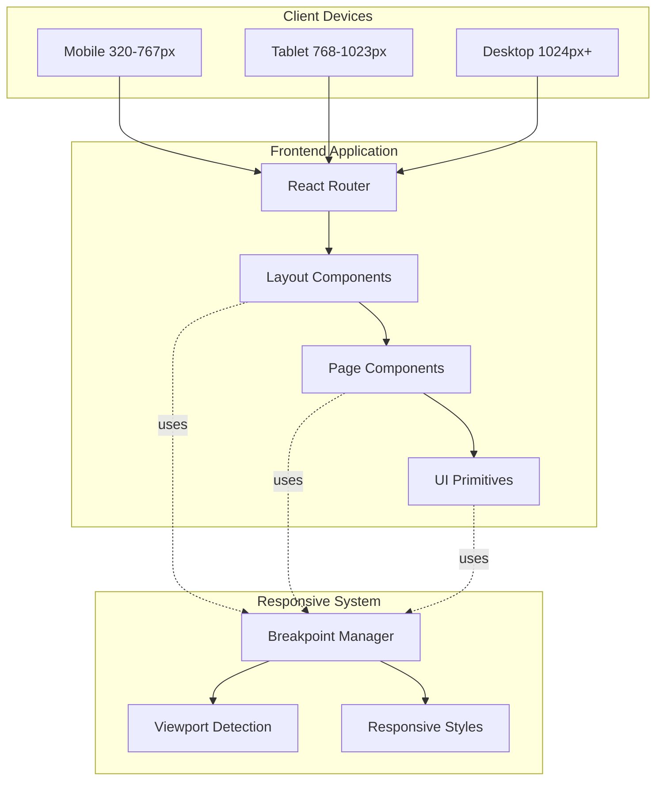

# Design Document: Responsive Web Design

## Overview

This design document outlines the technical approach for implementing responsive web design across the entire Clinic Management System frontend. The system currently serves 5 user roles (admin, receptionist, doctor, pharmacist, patient) with 30+ pages built using React 18, Vite 5, and Tailwind CSS 3. The responsive design implementation will ensure optimal user experience across all device sizes from mobile (320px+) to desktop (1920px+) using a mobile-first approach and Tailwind's utility-first CSS framework.

### Goals

- **Universal Responsiveness**: Ensure all 30+ pages adapt seamlessly to mobile (320-767px), tablet (768-1023px), and desktop (1024px+) viewports
- **Touch Optimization**: Provide touch-friendly interfaces with minimum 44x44px touch targets on mobile devices
- **Performance**: Maintain fast load times and smooth interactions on mobile networks through lazy loading and optimized assets
- **Consistency**: Establish reusable responsive patterns that work across all user roles and page types
- **Accessibility**: Preserve WCAG 2.1 AA compliance across all breakpoints

### Non-Goals

- Redesigning the visual identity or color scheme
- Adding new features beyond responsive behavior
- Supporting browsers older than the latest 2 versions
- Creating native mobile apps (this is web-only)

## Architecture

### System Context



### Component Hierarchy

The responsive design system operates at three levels:

1. **Layout Level**: `Layout.jsx` and `PatientLayout.jsx` provide responsive shell (header, sidebar, main content area)
2. **Page Level**: Individual page components apply responsive grid layouts and component arrangements
3. **Component Level**: UI primitives (DataTable, Card, Modal, Form) implement internal responsive behavior

### Breakpoint Strategy

Following Tailwind CSS defaults with mobile-first approach:

| Breakpoint | Min Width | Target Devices | Tailwind Prefix |
|------------|-----------|----------------|-----------------|
| Base | 0px | Mobile phones | (none) |
| sm | 640px | Large phones | `sm:` |
| md | 768px | Tablets | `md:` |
| lg | 1024px | Laptops | `lg:` |
| xl | 1280px | Desktops | `xl:` |
| 2xl | 1536px | Large desktops | `2xl:` |

**Mobile-First Principle**: Base styles target mobile, then progressively enhance for larger screens using `sm:`, `md:`, `lg:` prefixes.

## Components and Interfaces

### 1. Viewport Configuration

**Purpose**: Ensure proper viewport scaling and prevent unwanted zoom on mobile devices.

**Implementation**:
- Add viewport meta tag to `index.html`:
  ```html
  <meta name="viewport" content="width=device-width, initial-scale=1.0, maximum-scale=5.0">
  ```
- Configure Tailwind to prevent horizontal scroll:
  ```js
  // tailwind.config.js
  module.exports = {
    theme: {
      extend: {
        maxWidth: {
          'screen': '100vw'
        }
      }
    }
  }
  ```

**Interface**:
- No programmatic interface needed
- Declarative HTML configuration

### 2. Layout Components

#### 2.1 Responsive Sidebar Navigation

**Current State** (`Layout.jsx`, `PatientLayout.jsx`):
- Fixed sidebar at 256px width (`w-64`)
- Toggle button collapses sidebar to 0px width
- Sidebar overlays content on all screen sizes when open

**Responsive Design**:

```jsx
// Responsive sidebar behavior
<aside className={cn(
  "fixed left-0 top-16 bottom-0 bg-white border-r border-gray-200 transition-all duration-300 z-30",
  // Mobile: overlay with backdrop
  "md:translate-x-0",
  sidebarOpen 
    ? "translate-x-0 w-64" 
    : "-translate-x-full md:translate-x-0 md:w-0"
)}>
  {/* Navigation content */}
</aside>

// Backdrop for mobile overlay
{sidebarOpen && (
  <div 
    className="fixed inset-0 bg-black/50 z-20 md:hidden"
    onClick={() => setSidebarOpen(false)}
  />
)}

// Main content margin adjustment
<main className={cn(
  "pt-16 transition-all duration-300",
  "md:ml-0", // Mobile: no margin
  "lg:ml-64"  // Desktop: sidebar width when open
)}>
```

**Behavior by Breakpoint**:
- **Mobile (< 768px)**: Hamburger menu, sidebar slides in from left with backdrop overlay
- **Tablet (768-1023px)**: Sidebar collapses to icon-only or hidden, content takes full width
- **Desktop (1024px+)**: Sidebar visible by default, content adjusts margin

#### 2.2 Responsive Header

**Current State**:
- Fixed height 64px (`h-16`)
- Logo, hamburger, user menu, notifications
- User info shows full name + role

**Responsive Design**:

```jsx
<header className="bg-white border-b border-gray-200 fixed top-0 left-0 right-0 z-40 h-16">
  <div className="flex items-center justify-between px-4 h-full">
    {/* Left section */}
    <div className="flex items-center gap-2 md:gap-4">
      <button onClick={() => setSidebarOpen(!sidebarOpen)} className="p-2">
        {sidebarOpen ? <X className="w-5 h-5 md:w-6 md:h-6" /> : <Menu className="w-5 h-5 md:w-6 md:h-6" />}
      </button>
      <h1 className="text-base md:text-xl font-bold text-blue-600 truncate">
        <span className="hidden sm:inline">Phòng Khám Nội</span>
        <span className="sm:hidden">PKN</span>
      </h1>
    </div>
    
    {/* Right section */}
    <div className="flex items-center gap-2 md:gap-4">
      <NotificationDropdown />
      
      {/* User menu */}
      <button className="flex items-center gap-2 px-2 md:px-3 py-2">
        <div className="w-8 h-8 md:w-10 md:h-10 rounded-full bg-blue-500 flex items-center justify-center text-white text-xs md:text-sm font-semibold">
          {getInitials(currentUser?.fullName)}
        </div>
        {/* Hide user info on small screens */}
        <div className="hidden sm:block text-right">
          <p className="font-medium text-sm">{currentUser?.fullName}</p>
          <p className="text-xs text-gray-500">{getRoleLabel()}</p>
        </div>
        <ChevronDown className="w-4 h-4 hidden sm:block" />
      </button>
    </div>
  </div>
</header>
```

**Behavior by Breakpoint**:
- **Mobile (< 640px)**: Show avatar only, hide user name/role, abbreviate logo
- **Tablet (640-1023px)**: Show avatar + name, full logo
- **Desktop (1024px+)**: Show all elements with comfortable spacing

### 3. Page-Level Responsive Patterns

#### 3.1 Dashboard Card Grids

**Pattern**: Responsive grid for dashboard cards showing statistics, summaries, quick actions.

```jsx
// Dashboard page
<div className="grid grid-cols-1 sm:grid-cols-2 lg:grid-cols-3 xl:grid-cols-4 gap-4 md:gap-6">
  {statsCards.map(card => (
    <Card key={card.id} className="p-4 md:p-6">
      <CardHeader className="p-0 mb-3 md:mb-4">
        <CardTitle className="text-lg md:text-xl">{card.title}</CardTitle>
      </CardHeader>
      <CardContent className="p-0">
        <div className="text-2xl md:text-3xl font-bold">{card.value}</div>
        <p className="text-xs md:text-sm text-gray-500 mt-1">{card.subtitle}</p>
      </CardContent>
    </Card>
  ))}
</div>
```

**Grid Breakpoints**:
- Mobile: 1 column
- Small (640px+): 2 columns
- Large (1024px+): 3 columns
- XL (1280px+): 4 columns

#### 3.2 Data Table Responsive Behavior

**Current State** (`DataTable.jsx`):
- Full table with all columns
- Horizontal scroll on overflow
- Fixed column widths

**Responsive Enhancements**:

```jsx
// DataTable component
<div className="border border-gray-200 rounded-lg overflow-hidden">
  {/* Mobile: Card view */}
  <div className="md:hidden">
    {paginatedData.map(row => (
      <div key={row.id} className="border-b border-gray-200 p-4 space-y-2">
        {columns.slice(0, 3).map(col => (
          <div key={col.accessor} className="flex justify-between">
            <span className="text-sm font-medium text-gray-500">{col.header}:</span>
            <span className="text-sm text-gray-900">
              {col.render ? col.render(row[col.accessor], row) : row[col.accessor]}
            </span>
          </div>
        ))}
        {/* Action buttons */}
        <div className="flex gap-2 mt-3 pt-3 border-t">
          {row.actions}
        </div>
      </div>
    ))}
  </div>
  
  {/* Tablet/Desktop: Table view with horizontal scroll */}
  <div className="hidden md:block overflow-x-auto">
    <table className="w-full min-w-[640px]">
      {/* Table content */}
    </table>
  </div>
</div>
```

**Behavior by Breakpoint**:
- **Mobile (< 768px)**: Card-based list view showing 2-3 most important fields
- **Tablet/Desktop (768px+)**: Full table with horizontal scroll if needed
- **Column Priority**: Use `data-priority` attribute to show/hide columns based on importance

#### 3.3 Form Layouts

**Pattern**: Stack form fields vertically on mobile, multi-column on desktop.

```jsx
<form className="space-y-4 md:space-y-6">
  {/* Single column on mobile, 2 columns on tablet+ */}
  <div className="grid grid-cols-1 md:grid-cols-2 gap-4 md:gap-6">
    <div>
      <label className="block text-sm font-medium mb-2">Họ và tên</label>
      <input 
        type="text"
        className="w-full px-3 py-2 md:px-4 md:py-3 border rounded-lg min-h-[44px]"
      />
    </div>
    <div>
      <label className="block text-sm font-medium mb-2">Số điện thoại</label>
      <input 
        type="tel"
        className="w-full px-3 py-2 md:px-4 md:py-3 border rounded-lg min-h-[44px]"
      />
    </div>
  </div>
  
  {/* Full width fields */}
  <div>
    <label className="block text-sm font-medium mb-2">Địa chỉ</label>
    <textarea 
      className="w-full px-3 py-2 md:px-4 md:py-3 border rounded-lg min-h-[88px]"
      rows="3"
    />
  </div>
  
  {/* Action buttons */}
  <div className="flex flex-col sm:flex-row gap-3 sm:gap-4 sm:justify-end">
    <button 
      type="button"
      className="w-full sm:w-auto px-6 py-3 border rounded-lg min-h-[44px]"
    >
      Hủy
    </button>
    <button 
      type="submit"
      className="w-full sm:w-auto px-6 py-3 bg-blue-600 text-white rounded-lg min-h-[44px]"
    >
      Lưu
    </button>
  </div>
</form>
```

**Touch Target Requirements**:
- All inputs: minimum 44px height
- All buttons: minimum 44x44px
- Spacing between touch targets: minimum 8px

### 4. Component-Level Responsive Patterns

#### 4.1 Modal Dialogs

**Pattern**: Full-width on mobile, fixed-width centered on desktop.

```jsx
// Modal wrapper (using Radix UI Dialog)
<Dialog.Portal>
  <Dialog.Overlay className="fixed inset-0 bg-black/50 z-50" />
  <Dialog.Content className={cn(
    "fixed z-50 bg-white rounded-lg shadow-lg",
    // Mobile: nearly full screen with small margin
    "inset-x-4 top-[5%] bottom-[5%] max-h-[90vh]",
    // Tablet+: centered with fixed width
    "md:inset-x-auto md:top-1/2 md:left-1/2 md:-translate-x-1/2 md:-translate-y-1/2",
    "md:w-full md:max-w-lg md:max-h-[85vh]",
    // Large modals
    "lg:max-w-2xl"
  )}>
    {/* Fixed header */}
    <Dialog.Title className="px-4 md:px-6 py-4 border-b">
      <h2 className="text-lg md:text-xl font-semibold">Modal Title</h2>
    </Dialog.Title>
    
    {/* Scrollable content */}
    <div className="px-4 md:px-6 py-4 overflow-y-auto max-h-[calc(90vh-140px)] md:max-h-[calc(85vh-140px)]">
      {children}
    </div>
    
    {/* Fixed footer */}
    <div className="px-4 md:px-6 py-4 border-t flex flex-col sm:flex-row gap-3 sm:justify-end">
      <button className="w-full sm:w-auto px-4 py-2 min-h-[44px]">Cancel</button>
      <button className="w-full sm:w-auto px-4 py-2 min-h-[44px]">Confirm</button>
    </div>
  </Dialog.Content>
</Dialog.Portal>
```

#### 4.2 Chart Components

**Pattern**: Responsive container with adjusted heights and label formatting.

```jsx
// Reports page charts
<div className="bg-white rounded-lg border p-4 md:p-6">
  <h3 className="text-base md:text-lg font-semibold mb-4">Doanh thu theo tháng</h3>
  
  <ResponsiveContainer width="100%" height={250} className="md:h-[300px] lg:h-[350px]">
    <BarChart data={revenueByMonth}>
      <CartesianGrid strokeDasharray="3 3" />
      <XAxis 
        dataKey="month"
        tick={{ fontSize: 12 }}
        angle={-45}
        textAnchor="end"
        height={60}
        className="md:text-sm"
      />
      <YAxis 
        tick={{ fontSize: 12 }}
        className="md:text-sm"
      />
      <Tooltip 
        contentStyle={{ fontSize: '14px' }}
        labelStyle={{ fontWeight: 'bold' }}
      />
      <Legend 
        wrapperStyle={{ fontSize: '12px' }}
        className="md:text-sm"
      />
      <Bar dataKey="revenue" fill="#3b82f6" />
    </BarChart>
  </ResponsiveContainer>
</div>
```

**Responsive Adjustments**:
- Mobile: 250px height, 12px font, rotated labels
- Tablet: 300px height, 13px font
- Desktop: 350px height, 14px font, horizontal labels

#### 4.3 Dropdown Menus

**Pattern**: Adjust positioning to stay within viewport.

```jsx
// User menu dropdown
<div className="relative" ref={dropdownRef}>
  <button onClick={() => setOpen(!open)}>
    {/* Trigger */}
  </button>
  
  {open && (
    <div className={cn(
      "absolute mt-2 bg-white rounded-lg shadow-lg border z-50",
      // Mobile: full width with small margin
      "left-0 right-0 mx-4",
      // Tablet+: fixed width, positioned relative to trigger
      "sm:left-auto sm:right-0 sm:mx-0 sm:w-56"
    )}>
      {/* Menu items */}
    </div>
  )}
</div>
```

## Data Models

No new data models are required. The responsive design system operates purely at the presentation layer and does not affect data structures or API contracts.

## Correctness Properties

**Assessment**: Property-based testing is **NOT applicable** for this feature.

**Reasoning**: 
- Responsive web design is primarily about **UI rendering and layout** behavior
- Visual correctness cannot be verified through property-based tests
- Responsive behavior depends on **viewport dimensions and CSS media queries**, which are environmental factors rather than pure function inputs/outputs
- Testing approach should use:
  - **Visual regression tests** (screenshot comparison at different breakpoints)
  - **Manual testing** on real devices and browser DevTools
  - **Integration tests** for interactive behavior (sidebar toggle, dropdown positioning)
  - **Accessibility audits** (WCAG compliance, touch target sizes)

## Error Handling

### Viewport Detection Failures

**Scenario**: Browser does not support `window.matchMedia` or viewport meta tag is missing.

**Handling**:
- Provide fallback styles that assume desktop viewport
- Log warning to console for debugging
- Gracefully degrade to non-responsive layout

```js
// useMediaQuery hook with fallback
function useMediaQuery(query) {
  const [matches, setMatches] = useState(() => {
    if (typeof window === 'undefined' || !window.matchMedia) {
      return false; // SSR or unsupported browser
    }
    return window.matchMedia(query).matches;
  });
  
  useEffect(() => {
    if (typeof window === 'undefined' || !window.matchMedia) {
      console.warn('matchMedia not supported, using fallback');
      return;
    }
    
    const mediaQuery = window.matchMedia(query);
    const handler = (e) => setMatches(e.matches);
    
    mediaQuery.addEventListener('change', handler);
    return () => mediaQuery.removeEventListener('change', handler);
  }, [query]);
  
  return matches;
}
```

### Layout Shift Prevention

**Scenario**: Images or dynamic content cause layout to shift during load, creating poor UX.

**Handling**:
- Reserve space for images using aspect-ratio CSS or explicit width/height
- Use skeleton loaders for async content
- Implement lazy loading with placeholders

```jsx
// Image with aspect ratio preservation
<div className="relative w-full aspect-video bg-gray-200">
  
</div>

// Skeleton loader for data tables
{loading ? (
  <DataTableSkeleton columns={columns} />
) : (
  <DataTable data={data} columns={columns} />
)}
```

### Touch Target Validation

**Scenario**: Interactive elements are too small for touch on mobile devices.

**Handling**:
- Enforce minimum 44x44px touch targets via Tailwind utilities
- Add visual indicators when touch targets are too close
- Provide spacing utilities that ensure 8px minimum gap

```js
// Tailwind plugin for touch target validation (development only)
const plugin = require('tailwindcss/plugin');

module.exports = {
  plugins: [
    plugin(function({ addUtilities }) {
      addUtilities({
        '.touch-target': {
          'min-width': '44px',
          'min-height': '44px',
        },
        '.touch-spacing': {
          'margin': '4px', // 8px total gap between elements
        }
      });
    })
  ]
};
```

### Horizontal Scroll Prevention

**Scenario**: Content overflows viewport width causing horizontal scroll.

**Handling**:
- Set `overflow-x: hidden` on body
- Use `max-w-full` on all containers
- Implement horizontal scroll only where intentional (data tables)

```css
/* Global styles */
body {
  overflow-x: hidden;
  max-width: 100vw;
}

/* Intentional horizontal scroll */
.table-container {
  overflow-x: auto;
  -webkit-overflow-scrolling: touch; /* Smooth scroll on iOS */
}
```

## Testing Strategy

### Manual Testing

**Breakpoint Testing**:
- Test at standard breakpoints: 320px, 375px, 640px, 768px, 1024px, 1280px, 1920px
- Use Chrome DevTools device emulation for quick iteration
- Test on real devices: iPhone SE, iPhone 14, iPad, Android tablet, desktop

**Orientation Testing**:
- Test portrait and landscape orientations on mobile and tablet
- Verify layout adapts correctly on orientation change

**Touch Interaction Testing**:
- Verify all buttons/links have minimum 44x44px touch targets
- Test tap accuracy on small screens
- Verify hover states don't interfere with touch interactions

### Automated Testing

**Visual Regression Tests** (using Playwright or Cypress):
```js
// Example visual regression test
describe('Responsive Layout', () => {
  const viewports = [
    { width: 375, height: 667, name: 'mobile' },
    { width: 768, height: 1024, name: 'tablet' },
    { width: 1280, height: 720, name: 'desktop' }
  ];
  
  viewports.forEach(({ width, height, name }) => {
    it(`renders correctly on ${name}`, () => {
      cy.viewport(width, height);
      cy.visit('/dashboard');
      cy.matchImageSnapshot(`dashboard-${name}`);
    });
  });
});
```

**Integration Tests** (React Testing Library):
```js
// Test sidebar toggle behavior
describe('Sidebar Navigation', () => {
  it('toggles sidebar on mobile', () => {
    window.innerWidth = 375;
    render(<Layout><Dashboard /></Layout>);
    
    const hamburger = screen.getByRole('button', { name: /menu/i });
    expect(screen.getByRole('navigation')).not.toBeVisible();
    
    fireEvent.click(hamburger);
    expect(screen.getByRole('navigation')).toBeVisible();
    
    // Click backdrop to close
    const backdrop = screen.getByTestId('sidebar-backdrop');
    fireEvent.click(backdrop);
    expect(screen.getByRole('navigation')).not.toBeVisible();
  });
});
```

**Accessibility Tests** (axe-core):
```js
// Test WCAG compliance at different breakpoints
describe('Accessibility', () => {
  it('meets WCAG 2.1 AA on mobile', async () => {
    cy.viewport(375, 667);
    cy.visit('/dashboard');
    cy.injectAxe();
    cy.checkA11y(null, {
      rules: {
        'color-contrast': { enabled: true },
        'touch-target-size': { enabled: true }
      }
    });
  });
});
```

### Performance Testing

**Metrics to Track**:
- First Contentful Paint (FCP) < 1.8s on 3G
- Largest Contentful Paint (LCP) < 2.5s
- Cumulative Layout Shift (CLS) < 0.1
- Time to Interactive (TTI) < 3.8s on mobile

**Tools**:
- Lighthouse CI for automated performance audits
- WebPageTest for real-world mobile network testing
- Chrome DevTools Performance panel for profiling

### Test Coverage Goals

- **Unit Tests**: 80% coverage for responsive utility functions and hooks
- **Integration Tests**: 100% coverage for layout component responsive behavior
- **Visual Regression**: 100% coverage for all page types at 3 breakpoints (mobile, tablet, desktop)
- **Manual Testing**: 100% coverage on 2 real mobile devices, 1 tablet, 1 desktop

### Testing Checklist

Before marking responsive design complete, verify:

- [ ] No horizontal scroll at any breakpoint (320px - 1920px)
- [ ] All interactive elements meet 44x44px minimum on mobile
- [ ] Text remains readable without zoom (minimum 12px font size)
- [ ] Images maintain aspect ratio and don't cause layout shift
- [ ] Forms are usable with on-screen keyboard on mobile
- [ ] Modals fit within viewport at all breakpoints
- [ ] Data tables provide horizontal scroll or card view on mobile
- [ ] Charts render correctly and labels don't overlap
- [ ] Navigation is accessible via hamburger menu on mobile
- [ ] Dropdowns stay within viewport boundaries
- [ ] Touch targets have minimum 8px spacing
- [ ] Orientation changes don't break layout
- [ ] Performance metrics meet targets on 3G network
- [ ] WCAG 2.1 AA compliance maintained at all breakpoints
- [ ] Cross-browser testing passed (Chrome, Firefox, Safari, Edge)

---

## Implementation Notes

### Tailwind Configuration

Ensure `tailwind.config.js` is optimized for responsive design:

```js
/** @type {import('tailwindcss').Config} */
export default {
  content: [
    "./index.html",
    "./src/**/*.{js,jsx}"
  ],
  theme: {
    screens: {
      'sm': '640px',
      'md': '768px',
      'lg': '1024px',
      'xl': '1280px',
      '2xl': '1536px',
    },
    extend: {
      spacing: {
        'safe-top': 'env(safe-area-inset-top)',
        'safe-bottom': 'env(safe-area-inset-bottom)',
        'safe-left': 'env(safe-area-inset-left)',
        'safe-right': 'env(safe-area-inset-right)',
      },
      minHeight: {
        'touch': '44px',
      },
      minWidth: {
        'touch': '44px',
      }
    },
  },
  plugins: [],
}
```

### Custom Hooks

Create reusable hooks for responsive behavior:

```js
// hooks/useBreakpoint.js
export function useBreakpoint() {
  const [breakpoint, setBreakpoint] = useState('mobile');
  
  useEffect(() => {
    const updateBreakpoint = () => {
      const width = window.innerWidth;
      if (width < 640) setBreakpoint('mobile');
      else if (width < 768) setBreakpoint('sm');
      else if (width < 1024) setBreakpoint('md');
      else if (width < 1280) setBreakpoint('lg');
      else setBreakpoint('xl');
    };
    
    updateBreakpoint();
    window.addEventListener('resize', updateBreakpoint);
    return () => window.removeEventListener('resize', updateBreakpoint);
  }, []);
  
  return breakpoint;
}

// hooks/useMediaQuery.js
export function useMediaQuery(query) {
  const [matches, setMatches] = useState(false);
  
  useEffect(() => {
    const media = window.matchMedia(query);
    setMatches(media.matches);
    
    const listener = (e) => setMatches(e.matches);
    media.addEventListener('change', listener);
    return () => media.removeEventListener('change', listener);
  }, [query]);
  
  return matches;
}
```

### Performance Optimizations

1. **Lazy Load Images**:
```jsx

```

2. **Code Splitting by Route**:
```jsx
const Dashboard = lazy(() => import('./pages/admin/Dashboard'));
```

3. **Optimize Tailwind Bundle**:
```js
// postcss.config.js
module.exports = {
  plugins: {
    tailwindcss: {},
    autoprefixer: {},
    ...(process.env.NODE_ENV === 'production' ? { cssnano: {} } : {})
  }
}
```

4. **Virtualize Long Lists**:
```jsx
import { FixedSizeList } from 'react-window';

<FixedSizeList
  height={600}
  itemCount={items.length}
  itemSize={50}
  width="100%"
>
  {({ index, style }) => (
    <div style={style}>{items[index]}</div>
  )}
</FixedSizeList>
```

### Browser Compatibility

Target browsers (latest 2 versions):
- Chrome/Edge (Chromium)
- Firefox
- Safari (iOS and macOS)

Use autoprefixer for vendor prefixes. Test on:
- iOS Safari (iPhone, iPad)
- Chrome for Android
- Desktop browsers

### Accessibility Considerations

- Maintain semantic HTML structure across breakpoints
- Ensure focus indicators remain visible at all sizes
- Update ARIA attributes when layout changes (e.g., `aria-expanded` for mobile menu)
- Test with screen readers at different breakpoints
- Verify keyboard navigation works on all devices

---

## Summary

This design document provides a comprehensive approach to implementing responsive web design across the Clinic Management System. The strategy leverages Tailwind CSS's mobile-first utility classes, establishes consistent responsive patterns at layout/page/component levels, and ensures optimal user experience across all device sizes while maintaining performance and accessibility standards.

Key implementation priorities:
1. Update Layout components for responsive sidebar and header
2. Implement responsive patterns for data tables (card view on mobile)
3. Ensure all forms and modals adapt to mobile viewports
4. Optimize charts and visualizations for small screens
5. Validate touch target sizes and spacing
6. Conduct thorough testing across breakpoints and devices